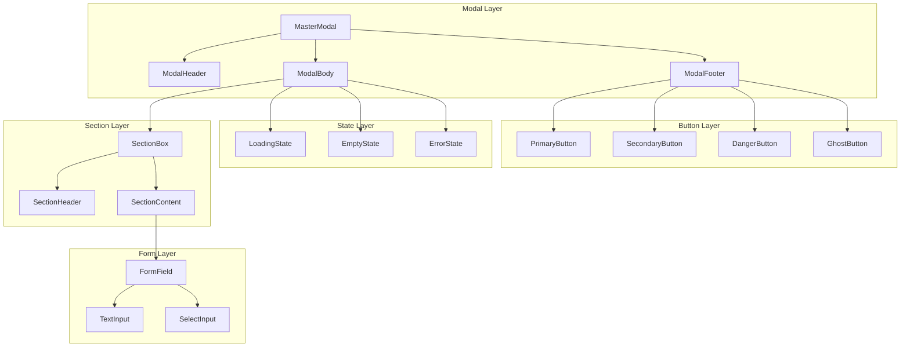

# 🏗 UI Component Architecture — VietSale Pro v7

> **Phiên bản:** V1  
> **Mục đích:** Định nghĩa kiến trúc component ở cấp độ nền tảng (Component Architecture Level), trả lời câu hỏi mỗi component "trông như thế nào", "hoạt động ra sao", và "quan hệ với nhau thế nào".  
> **Phạm vi:** Modal Layer, Section Layer, Form Layer, Button Layer, State Layer.

---

## Mục lục

1. [Component Hierarchy (Sơ đồ cây)](#1-component-hierarchy)
2. [Modal Layer](#2-modal-layer)
   - 2.1 [MasterModal](#21-mastermodal)
   - 2.2 [ModalHeader](#22-modalheader)
   - 2.3 [ModalBody](#23-modalbody)
   - 2.4 [ModalFooter](#24-modalfooter)
3. [Section Layer](#3-section-layer)
   - 3.1 [SectionBox](#31-sectionbox)
   - 3.2 [SectionHeader](#32-sectionheader)
   - 3.3 [SectionContent](#33-sectioncontent)
4. [Form Layer](#4-form-layer)
   - 4.1 [FormField](#41-formfield)
   - 4.2 [TextInput](#42-textinput)
   - 4.3 [SelectInput](#43-selectinput)
5. [Button Layer](#5-button-layer)
   - 5.1 [PrimaryButton](#51-primarybutton)
   - 5.2 [SecondaryButton](#52-secondarybutton)
   - 5.3 [DangerButton](#53-dangerbutton)
   - 5.4 [GhostButton](#54-ghostbutton)
6. [State Layer](#6-state-layer)
   - 6.1 [LoadingState](#61-loadingstate)
   - 6.2 [EmptyState](#62-emptystate)
   - 6.3 [ErrorState](#63-errorstate)
7. [File Structure Đề Xuất](#7-file-structure-đề-xuất)
8. [Migration Path](#8-migration-path)

---

## 1. Component Hierarchy



**Quan hệ cha-con:**

| Component Cha | Component Con | Kiểu quan hệ |
|---|---|---|
| `MasterModal` | `ModalHeader` + `ModalBody` + `ModalFooter` | Composition (children slot) |
| `ModalBody` | `SectionBox`, `LoadingState`, `EmptyState`, `ErrorState`, form fields | Content slot |
| `SectionBox` | `SectionHeader` + `SectionContent` | Composition (children slot) |
| `SectionContent` | `FormField`, `TextInput`, `SelectInput`, buttons | Content slot |
| `FormField` | `TextInput`, `SelectInput` | Wrapper (children slot) |

---

## 2. Modal Layer

### 2.1 MasterModal

**Mô tả:** Container trung tâm cho modal chi tiết, quản lý backdrop, animation, và cấu trúc header/body/footer.

**Props:**

```typescript
export type ModalSize = 'sm' | 'md' | 'lg' | 'xl' | 'full';

export interface MasterModalProps {
  /** Mở/đóng modal — controlled từ parent */
  isOpen:                boolean;
  /** Callback khi đóng modal */
  onClose:               () => void;
  /** Tiêu đề modal (truyền xuống ModalHeader) */
  title:                 string;
  /** Icon header (tuỳ chọn) */
  icon?:                 React.ReactNode;
  /** Badge header (tuỳ chọn, ví dụ trạng thái) */
  badge?:                React.ReactNode;
  /** Phụ đề (tuỳ chọn) */
  subtitle?:             string;
  /** Nội dung body */
  children:              React.ReactNode;
  /** Nội dung footer (nếu không truyền, không render footer) */
  footer?:               React.ReactNode;
  /** Kích thước modal — mặc định 'lg' */
  size?:                 ModalSize;
  /** Màu accent cho icon gradient — mặc định '#7c3aed' (violet) */
  accentColor?:          string;
  /** Vô hiệu hoá đóng khi click backdrop */
  disableBackdropClose?: boolean;
  /** CSS class bổ sung (tuỳ chọn) */
  className?:            string;
}
```

**Children:**

| Slot | Component tương ứng | Bắt buộc? |
|---|---|---|
| `children` | `ModalBody` (nội dung chính) | ✅ Có |
| `footer` | `ModalFooter` (hàng nút) | ❌ Không |

Lưu ý: `MasterModal` tự render `ModalHeader` và `ModalFooter` bên trong — không cần truyền riêng header component.

**State:**

| State | Kiểu | Nguồn | Mô tả |
|---|---|---|---|
| `isOpen` | `boolean` | Props từ parent | Điều khiển hiển thị |
| Animation | CSS `@keyframes mmFadeUp` | Internal | Fade up + scale khi mở |

**Tailwind classes:**

```tsx
// Container chính
className="fixed inset-0 z-[9999] flex items-center justify-center p-4"

// Backdrop
className="absolute inset-0 backdrop-blur-[2px]"

// Dialog
className="relative w-full flex flex-col max-h-[92vh]"
// Kích thước động dựa trên SIZE_MAP:
// sm → max-w-sm, md → max-w-lg, lg → max-w-2xl, xl → max-w-5xl, full → max-w-[96vw]
```

**Design Token sử dụng:**

| Token | Giá trị mặc định | Mục đích |
|---|---|---|
| `--modal-bg` | `#ffffff` | Nền dialog |
| `--modal-overlay` | `rgba(15,23,42,0.52)` | Màu backdrop |
| `--modal-shadow` | `0 24px 64px -12px rgba(15,23,42,.28)` | Box shadow dialog |
| `--modal-border` | `#e2e8f0` | Viền dialog |
| `--modal-radius` | `1rem` | Bo góc dialog |
| `--modal-header-bg` | `#f8fafc` | Nền header |
| `--modal-footer-bg` | `#f8fafc` | Nền footer |
| `--modal-title-color` | `#0f172a` | Màu tiêu đề |
| `--modal-subtitle-color` | `#94a3b8` | Màu phụ đề |
| `--modal-label-color` | `#64748b` | Màu label |
| `--modal-value-color` | `#1e293b` | Màu value |

**Dependencies:**

- `react` (React.FC)
- `lucide-react` (X icon)
- `ModalHeader` (internal render)
- `ModalFooter` (internal render — optional)

**Code mẫu:**

```tsx
import { MasterModal } from './components/MasterModal';
import { ModalButton } from './components/MasterModal';

<MasterModal
  isOpen={isOpen}
  onClose={() => setIsOpen(false)}
  title="Chi tiết đơn hàng"
  icon={<ShoppingBag className="w-5 h-5" />}
  badge={<StatusBadge label="Hoàn thành" variant="success" />}
  subtitle="Mã: ORD-2024-00123"
  size="lg"
  accentColor="#059669"
  footer={
    <>
      <ModalButton variant="secondary" onClick={onClose}>Đóng</ModalButton>
      <ModalButton variant="primary" onClick={handlePrint}>In phiếu</ModalButton>
    </>
  }
>
  {/* SectionBox — xem mục 3.1 */}
  <SectionBox title="Thông tin chung">
    <ModalInfoGrid items={infoItems} />
  </SectionBox>
</MasterModal>
```

---

### 2.2 ModalHeader

**Mô tả:** Phần header của modal, chứa icon + title + badge + subtitle + nút close.

**Props:**

```typescript
export interface ModalHeaderProps {
  /** Tiêu đề chính */
  title:                string;
  /** Callback đóng modal */
  onClose:              () => void;
  /** Icon tròn gradient bên trái */
  icon?:                React.ReactNode;
  /** Badge bên cạnh title */
  badge?:               React.ReactNode;
  /** Phụ đề nhỏ bên dưới title */
  subtitle?:            string;
  /** Màu accent cho gradient icon */
  accentColor?:         string;
  /** CSS class bổ sung */
  className?:           string;
}
```

**Children:** Không nhận children (sử dụng props).  
**State:** Stateless — không có internal state.

**Tailwind classes:**

```tsx
// Wrapper
className="flex items-start justify-between gap-3 px-6 py-4 shrink-0 rounded-t-[inherit]"

// Icon container
className="shrink-0 w-10 h-10 rounded-xl flex items-center justify-center text-white shadow-sm"

// Title
className="text-base font-bold text-slate-800 truncate leading-snug"

// Subtitle
className="text-xs text-slate-400 mt-0.5 truncate"

// Close button
className="shrink-0 p-1.5 rounded-lg text-slate-400 hover:text-slate-600 hover:bg-slate-200/70 transition-colors"
```

**Design Token sử dụng:**

| Token | Giá trị mặc định | Vai trò |
|---|---|---|
| `--modal-header-bg` | `#f8fafc` | Nền header |
| `--modal-border` | `#e2e8f0` | Border bottom |
| `--modal-title-color` | `#0f172a` | Màu title |
| `--modal-subtitle-color` | `#94a3b8` | Màu subtitle |
| `--font-size-base` | `14px` | Title |
| `--font-size-xs` | `12px` | Subtitle |

**Dependencies:** Không (chỉ dùng prop `title`, `onClose`)

**Code mẫu:**

```tsx
// Sử dụng độc lập (không khuyến khích — nên dùng qua MasterModal)
<ModalHeader
  title="Chi tiết sản phẩm"
  icon={<Package className="w-5 h-5" />}
  badge={<StatusBadge label="Còn hàng" variant="success" />}
  subtitle="Mã SP: SP-001"
  accentColor="#7c3aed"
  onClose={handleClose}
/>
```

---

### 2.3 ModalBody

**Mô tả:** Phần nội dung chính của modal, có scroll khi overflow.

**Props:**

```typescript
export interface ModalBodyProps {
  /** Nội dung bên trong (SectionBox, form, state components...) */
  children:  React.ReactNode;
  /** CSS class bổ sung */
  className?: string;
}
```

**Children:**

| Kiểu | Ví dụ | Ghi chú |
|---|---|---|
| `SectionBox` | Thông tin chung, dòng hàng | Kết hợp phổ biến |
| `FormField` | Form nhập liệu | Khi modal có edit |
| `LoadingState` | Spinner khi đang tải | Loading state |
| `EmptyState` | Thông báo không có dữ liệu | Empty state |
| `ErrorState` | Thông báo lỗi | Error state |

**State:** Stateless — chỉ là scroll container.

**Tailwind classes:**

```tsx
className="overflow-y-auto flex-1 p-6 space-y-4"
// custom-scrollbar (tuỳ chọn — cần định nghĩa global)
```

**Design Token sử dụng:**

| Token | Giá trị | Vai trò |
|---|---|---|
| `--modal-bg` | `#ffffff` | Màu nền |

**Dependencies:** Không

**Code mẫu:**

```tsx
<ModalBody>
  <SectionBox title="Thông tin chung">
    <ModalInfoGrid items={generalInfo} />
  </SectionBox>

  <SectionBox title="Dòng hàng" icon={<Package className="w-3.5 h-3.5" />}>
    <ModalTable headers={['Sản phẩm', 'SL', 'Đơn giá']} rows={lineRows} />
  </SectionBox>

  <SectionBox title="Tổng kết">
    <SummaryRow label="Tổng cộng" value="1,250,000₫" bold />
  </SectionBox>
</ModalBody>
```

---

### 2.4 ModalFooter

**Mô tả:** Phần footer của modal, chứa các nút hành động.

**Props:**

```typescript
export interface ModalFooterProps {
  /** Nội dung (thường là PrimaryButton, SecondaryButton, DangerButton...) */
  children:  React.ReactNode;
  /** Căn chỉnh — mặc định 'end' (right) */
  align?:    'start' | 'center' | 'end';
  /** CSS class bổ sung */
  className?: string;
}
```

**Children:**

| Kiểu | Mục đích |
|---|---|
| `PrimaryButton` | Hành động chính (Lưu, Xác nhận) |
| `SecondaryButton` | Hành động phụ (Đóng, Hủy) |
| `DangerButton` | Hành động nguy hiểm (Xóa) |
| `GhostButton` | Hành động không nổi bật |

**State:** Stateless.

**Tailwind classes:**

```tsx
// Wrapper
className="flex items-center gap-3 px-6 py-4 shrink-0 rounded-b-[inherit]"

// Align end
className="justify-end"

// Align center
className="justify-center"

// Align start
className="justify-start"
```

**Design Token sử dụng:**

| Token | Giá trị | Vai trò |
|---|---|---|
| `--modal-footer-bg` | `#f8fafc` | Nền footer |
| `--modal-border` | `#e2e8f0` | Border top |

**Dependencies:** Không

**Code mẫu:**

```tsx
<ModalFooter align="end">
  <SecondaryButton onClick={onClose}>Hủy</SecondaryButton>
  <PrimaryButton onClick={handleSave}>Lưu thay đổi</PrimaryButton>
</ModalFooter>

// Canh giữa
<ModalFooter align="center">
  <PrimaryButton onClick={handleConfirm}>Xác nhận</PrimaryButton>
</ModalFooter>

// 3 nút
<ModalFooter align="end">
  <GhostButton onClick={handlePreview}>Xem trước</GhostButton>
  <SecondaryButton onClick={onClose}>Hủy</SecondaryButton>
  <DangerButton onClick={handleDelete}>Xóa</DangerButton>
</ModalFooter>
```

---

## 3. Section Layer

### 3.1 SectionBox

**Mô tả:** Khối thông tin có viền + tiêu đề, dùng để nhóm nội dung trong ModalBody.

**Props:**

```typescript
export type SectionVariant = 'default' | 'accent' | 'warning' | 'danger';

export interface SectionBoxProps {
  /** Tiêu đề section (truyền xuống SectionHeader) */
  title?:    string;
  /** Icon bên cạnh tiêu đề */
  icon?:     React.ReactNode;
  /** Màu accent dạng Tailwind class — mặc định 'bg-slate-50 border-slate-200' */
  accent?:   string;
  /** Variant màu sắc */
  variant?:  SectionVariant;
  /** Nội dung bên trong (SectionContent, FormField, ModalTable...) */
  children:  React.ReactNode;
  /** CSS class bổ sung */
  className?: string;
}
```

**Children:**

| Slot | Component | Mô tả |
|---|---|---|
| `title` (prop) | `SectionHeader` | Tiêu đề (render tự động) |
| `children` | `SectionContent` | Nội dung |

Không nhận `SectionHeader` hay `SectionContent` riêng lẻ — `SectionBox` tự render cả hai.

**State:** Stateless.

**Tailwind classes:**

```tsx
// Default variant
className="rounded-xl border p-4 bg-slate-50 border-slate-200"

// Accent variant
className="rounded-xl border p-4 bg-violet-50 border-violet-200"

// Warning variant
className="rounded-xl border p-4 bg-amber-50 border-amber-200"

// Danger variant
className="rounded-xl border p-4 bg-red-50 border-red-200"
```

**Design Token sử dụng:**

| Token | Giá trị | Vai trò |
|---|---|---|
| `--radius-lg` | `12px` | Bo góc section |
| `--card-padding` | `16px` | Padding |
| `--modal-label-color` | `#64748b` | Màu chữ title |
| `--color-gray-50` | `#f8fafc` | Nền section |
| `--color-gray-200` | `#e2e8f0` | Viền section |

**Dependencies:** `SectionHeader`, `SectionContent` (internal)

**Code mẫu:**

```tsx
<SectionBox title="Thông tin chung" icon={<Info className="w-3.5 h-3.5" />}>
  <ModalInfoGrid items={infoItems} />
</SectionBox>

<SectionBox title="Dòng hàng" variant="accent">
  <ModalTable headers={headers} rows={rows} />
</SectionBox>
```

---

### 3.2 SectionHeader

**Mô tả:** Tiêu đề của SectionBox, dạng chữ in hoa nhỏ + tracking rộng.

**Props:**

```typescript
export interface SectionHeaderProps {
  /** Nội dung tiêu đề */
  children:  React.ReactNode;
  /** Icon bên trái */
  icon?:     React.ReactNode;
  /** Nút action bên phải (ví dụ "Thêm mới") */
  action?:   React.ReactNode;
  /** CSS class bổ sung */
  className?: string;
}
```

**Children:** `ReactNode` — nội dung text title.

**State:** Stateless.

**Tailwind classes:**

```tsx
className="text-[11px] font-semibold uppercase tracking-widest text-slate-400 mb-3 flex items-center gap-1.5"
className="ml-auto" // action slot
```

**Design Token sử dụng:**

| Token | Giá trị | Vai trò |
|---|---|---|
| `--font-size-xs` | `12px` | Cỡ chữ (gần 11px) |
| `--font-weight-semibold` | `600` | Đậm chữ |
| `--modal-label-color` | `#64748b` | Màu chữ |

**Dependencies:** Không

**Code mẫu:**

```tsx
{/* Sử dụng qua SectionBox */}
<SectionBox title="Dòng hàng" />

{/* Sử dụng độc lập */}
<SectionHeader icon={<Package className="w-3.5 h-3.5" />} action={<GhostButton size="sm">+ Thêm</GhostButton>}>
  Dòng hàng
</SectionHeader>
```

---

### 3.3 SectionContent

**Mô tả:** Container nội dung bên trong SectionBox. Chỉ là wrapper với spacing.

**Props:**

```typescript
export interface SectionContentProps {
  /** Nội dung (ModalInfoGrid, ModalTable, FormField...) */
  children:  React.ReactNode;
  /** CSS class bổ sung */
  className?: string;
}
```

**Children:**

| Kiểu | Ví dụ |
|---|---|
| `ModalInfoGrid` | Grid label/value |
| `ModalTable` | Bảng dữ liệu |
| `FormField` | Form field |
| `TextInput` / `SelectInput` | Input fields |
| JSX elements | Nội dung custom |

**State:** Stateless.

**Tailwind classes:**

```tsx
className="space-y-2"
// hoặc
className="space-y-3"
```

**Design Token sử dụng:** Không.

**Dependencies:** Không.

**Code mẫu:**

```tsx
<SectionContent>
  <ModalInfoGrid items={items} />
</SectionContent>

<SectionContent>
  <FormField label="Tên sản phẩm" required>
    <TextInput value={name} onChange={setName} placeholder="Nhập tên sản phẩm" />
  </FormField>
  <FormField label="Danh mục">
    <SelectInput value={category} onChange={setCategory} options={categories} />
  </FormField>
</SectionContent>
```

---

## 4. Form Layer

### 4.1 FormField

**Mô tả:** Wrapper cho input field, hiển thị label + required indicator + error message + hint text.

**Props:**

```typescript
export interface FormFieldProps {
  /** Nhãn của field */
  label:          string;
  /** Hiển thị dấu * bắt buộc */
  required?:      boolean;
  /** Nội dung lỗi (hiển thị màu đỏ) */
  error?:         string;
  /** Gợi ý phụ (hiển thị màu xám) */
  hint?:          string;
  /** Input component (TextInput, SelectInput) */
  children:       React.ReactNode;
  /** CSS class bổ sung */
  className?:     string;
}
```

**Children:** Một component input duy nhất (`TextInput` hoặc `SelectInput`).

**State:**

| State | Kiểu | Mô tả |
|---|---|---|
| `error` | `string \| undefined` | Props — kiểm soát hiển thị error message |

**Tailwind classes:**

```tsx
// Wrapper
className="space-y-1.5"

// Label
className="block text-sm font-semibold text-slate-600"

// Required asterisk
className="text-red-500 ml-0.5"

// Error message
className="text-xs text-red-500 flex items-center gap-1 mt-1"

// Hint text
className="text-xs text-slate-400 mt-1"
```

**Design Token sử dụng:**

| Token | Giá trị | Vai trò |
|---|---|---|
| `--font-size-sm` | `13px` | Cỡ chữ label |
| `--font-weight-semibold` | `600` | Đậm label |
| `--color-gray-600` | `#475569` | Màu label |
| `--color-danger-500` | `#ef4444` | Màu error |
| `--font-size-xs` | `12px` | Cỡ chữ error/hint |

**Dependencies:** Không (chỉ wrapper).

**Code mẫu:**

```tsx
<FormField label="Tên sản phẩm" required error="Vui lòng nhập tên sản phẩm">
  <TextInput value={name} onChange={setName} placeholder="Nhập tên sản phẩm" />
</FormField>

<FormField label="Danh mục" hint="Chọn danh mục phù hợp">
  <SelectInput value={category} onChange={setCategory} options={categories} placeholder="-- Chọn danh mục --" />
</FormField>
```

---

### 4.2 TextInput

**Mô tả:** Input text có hỗ trợ icon trái/phải, focus ring, variant success/error.

**Props:**

```typescript
export type InputVariant = 'default' | 'success' | 'error';

export interface TextInputProps extends Omit<React.InputHTMLAttributes<HTMLInputElement>, 'size'> {
  /** Variant màu viền */
  variant?:     InputVariant;
  /** Icon bên trái input */
  leftIcon?:    React.ReactNode;
  /** Icon bên phải input (ví dụ mắt xem password) */
  rightIcon?:   React.ReactNode;
  /** CSS class bổ sung */
  className?:   string;
}
```

Kế thừa tất cả HTMLInputElement attributes: `value`, `onChange`, `placeholder`, `disabled`, `readOnly`, `type`, `maxLength`, `autoFocus`, v.v.

**Children:** Không nhận children (dùng props).

**State:** `value` — controlled từ parent qua `value`/`onChange` props.

**Tailwind classes:**

```tsx
// Base
className="w-full px-3.5 py-2.5 bg-white rounded-lg text-sm font-regular text-slate-800 outline-none transition-all duration-200 placeholder:text-slate-400 hover:border-slate-300"

// Default variant
className="border border-slate-200 focus:border-violet-500 focus:ring-2 focus:ring-violet-500/10"

// Success variant
className="border border-emerald-300 focus:border-emerald-500 focus:ring-2 focus:ring-emerald-500/10"

// Error variant
className="border border-red-300 focus:border-red-500 focus:ring-2 focus:ring-red-500/10"

// Left icon padding
className="pl-10"

// Right icon padding
className="pr-10"
```

**Design Token sử dụng:**

| Token | Giá trị | Vai trò |
|---|---|---|
| `--input-height-md` | `40px` | Chiều cao (py-2.5) |
| `--input-radius` | `10px` | Bo góc (rounded-lg ≈ 10px) |
| `--font-size-sm` | `13px` | Cỡ chữ |
| `--color-gray-50` → `--color-gray-800` | | Màu nền, chữ, border |

**Dependencies:** Không.

**Code mẫu:**

```tsx
{/* Cơ bản */}
<TextInput value={name} onChange={(e) => setName(e.target.value)} placeholder="Nhập tên" />

{/* Với icon */}
<TextInput
  value={search}
  onChange={handleSearch}
  placeholder="Tìm kiếm..."
  leftIcon={<Search className="w-4 h-4" />}
/>

{/* Error variant */}
<TextInput
  value={code}
  onChange={setCode}
  variant="error"
  placeholder="Mã sản phẩm"
/>

{/* Disabled */}
<TextInput value={readonlyValue} disabled />
```

---

### 4.3 SelectInput

**Mô tả:** Select dropdown có hỗ trợ icon trái, variant success/error.

**Props:**

```typescript
export interface SelectInputProps extends Omit<React.SelectHTMLAttributes<HTMLSelectElement>, 'size'> {
  /** Danh sách option */
  options:      Array<{ value: string; label: string }>;
  /** Variant màu viền */
  variant?:     InputVariant;
  /** Icon bên trái */
  leftIcon?:    React.ReactNode;
  /** Placeholder option (-- Chọn --) */
  placeholder?: string;
  /** CSS class bổ sung */
  className?:   string;
}
```

**Children:** Không nhận children (dùng `options` prop).

**State:** `value` — controlled từ parent.

**Tailwind classes:**

```tsx
// Base
className="w-full px-3.5 py-2.5 bg-white rounded-lg text-sm font-regular text-slate-800 outline-none transition-all duration-200 hover:border-slate-300 appearance-none"

// Default variant
className="border border-slate-200 focus:border-violet-500 focus:ring-2 focus:ring-violet-500/10"

// Chevron icon (background SVG data URI)
className="bg-no-repeat bg-right-3.5"
```

**Design Token sử dụng:**

| Token | Giá trị | Vai trò |
|---|---|---|
| `--input-height-md` | `40px` | Chiều cao |
| `--input-radius` | `10px` | Bo góc |
| `--font-size-sm` | `13px` | Cỡ chữ |
| `--color-gray-200` | `#e2e8f0` | Viền |

**Dependencies:** Không.

**Code mẫu:**

```tsx
const categoryOptions = [
  { value: '', label: '-- Chọn danh mục --' },
  { value: 'food', label: 'Thực phẩm' },
  { value: 'drink', label: 'Đồ uống' },
  { value: 'other', label: 'Khác' },
];

<SelectInput
  value={category}
  onChange={(e) => setCategory(e.target.value)}
  options={categoryOptions}
  variant="default"
/>

<SelectInput
  value={status}
  onChange={setStatus}
  options={statusOptions}
  leftIcon={<Filter className="w-4 h-4" />}
  variant="success"
/>
```

---

## 5. Button Layer

### 5.1 PrimaryButton

**Mô tả:** Nút hành động chính — màu violet/violet gradient, nổi bật nhất.

**Props:**

```typescript
export interface PrimaryButtonProps {
  /** Click handler */
  onClick?:       () => void;
  /** Loại button */
  type?:          'button' | 'submit';
  /** Disabled state */
  disabled?:      boolean;
  /** Loading state (hiển thị spinner) */
  loading?:       boolean;
  /** Kích thước — mặc định 'md' */
  size?:          'sm' | 'md' | 'lg';
  /** Icon bên trái text */
  icon?:          React.ReactNode;
  /** Nội dung text */
  children:       React.ReactNode;
  /** CSS class bổ sung */
  className?:     string;
}
```

**Children:** `ReactNode` — text hoặc text + icon.

**State:**

| State | Kiểu | Mô tả |
|---|---|---|
| `loading` | `boolean` | Props — hiển thị spinner thay text |
| `disabled` | `boolean` | Props — ngăn click + opacity 50% |

**Tailwind classes:**

```tsx
// Base
className="inline-flex items-center gap-2 px-4 py-2 rounded-xl text-sm font-semibold transition-colors"

// Primary variant
className="bg-violet-600 text-white hover:bg-violet-700 shadow-sm disabled:opacity-50 disabled:cursor-not-allowed"

// Size sm
className="px-3 py-1.5 text-xs"

// Size md
className="px-4 py-2 text-sm"

// Size lg
className="px-6 py-2.5 text-base"
```

**Design Token sử dụng:**

| Token | Giá trị | Vai trò |
|---|---|---|
| `--color-primary-600` | `#1d4ed8` (đang dùng violet) | Background |
| `--button-height-md` | `40px` | Chiều cao |
| `--radius-md` | `10px` | Bo góc |
| `--font-size-sm` | `13px` | Cỡ chữ |
| `--font-weight-semibold` | `600` | Đậm chữ |

**Dependencies:** Không.

**Code mẫu:**

```tsx
<PrimaryButton onClick={handleSave}>
  Lưu thay đổi
</PrimaryButton>

<PrimaryButton onClick={handleSave} loading disabled={!isValid}>
  <Save className="w-4 h-4" />
  Lưu thay đổi
</PrimaryButton>

<PrimaryButton type="submit" size="lg">
  Xác nhận
</PrimaryButton>
```

---

### 5.2 SecondaryButton

**Mô tả:** Nút hành động phụ — nền trắng + viền + hover xám nhạt.

**Props:** Giống `PrimaryButtonProps`.

**Children:** `ReactNode`.

**State:** Giống `PrimaryButton`.

**Tailwind classes:**

```tsx
// Base
className="inline-flex items-center gap-2 px-4 py-2 rounded-xl text-sm font-semibold transition-colors"

// Secondary variant
className="bg-white text-slate-700 border border-slate-200 hover:bg-slate-50 disabled:opacity-50 disabled:cursor-not-allowed"
```

**Design Token sử dụng:**

| Token | Giá trị | Vai trò |
|---|---|---|
| `--color-gray-50` | `#f8fafc` | Hover background |
| `--color-gray-200` | `#e2e8f0` | Border |
| `--color-gray-700` | `#334155` | Text color |

**Dependencies:** Không.

**Code mẫu:**

```tsx
<SecondaryButton onClick={onClose}>
  Hủy
</SecondaryButton>

<SecondaryButton onClick={onClose} icon={<X className="w-4 h-4" />}>
  Đóng
</SecondaryButton>
```

---

### 5.3 DangerButton

**Mô tả:** Nút hành động nguy hiểm — nền đỏ nhạt + chữ đỏ + viền đỏ.

**Props:** Giống `PrimaryButtonProps`.

**Children:** `ReactNode`.

**State:** Giống `PrimaryButton`.

**Tailwind classes:**

```tsx
// Base
className="inline-flex items-center gap-2 px-4 py-2 rounded-xl text-sm font-semibold transition-colors"

// Danger variant
className="bg-red-50 text-red-600 border border-red-200 hover:bg-red-100 disabled:opacity-50 disabled:cursor-not-allowed"
```

**Design Token sử dụng:**

| Token | Giá trị | Vai trò |
|---|---|---|
| `--color-danger-50` | `#fef2f2` | Background |
| `--color-danger-600` | `#dc2626` | Text color |
| `--color-danger-200` | `#fecaca` | Border |

**Dependencies:** Không.

**Code mẫu:**

```tsx
<DangerButton onClick={handleDelete}>
  <Trash2 className="w-4 h-4" />
  Xóa sản phẩm
</DangerButton>

<DangerButton onClick={handleDelete} loading>
  Đang xóa...
</DangerButton>
```

---

### 5.4 GhostButton

**Mô tả:** Nút không viền, không nền — chỉ hiện khi hover. Dùng cho action phụ, context-aware.

**Props:** Giống `PrimaryButtonProps`.

**Children:** `ReactNode`.

**State:** Giống `PrimaryButton`.

**Tailwind classes:**

```tsx
// Base
className="inline-flex items-center gap-2 px-4 py-2 rounded-xl text-sm font-semibold transition-colors"

// Ghost variant — size sm (thường dùng)
className="text-slate-500 hover:bg-slate-100 disabled:opacity-50 disabled:cursor-not-allowed"
```

**Design Token sử dụng:**

| Token | Giá trị | Vai trò |
|---|---|---|
| `--color-gray-500` | `#64748b` | Text color |
| `--color-gray-100` | `#f1f5f9` | Hover background |

**Dependencies:** Không.

**Code mẫu:**

```tsx
<GhostButton onClick={handlePreview}>
  Xem trước
</GhostButton>

{/* Dùng trong SectionHeader action slot */}
<SectionHeader icon={icon} action={<GhostButton size="sm">+ Thêm dòng</GhostButton>}>
  Dòng hàng
</SectionHeader>
```

---

### Button Variant Matrix

| Tính năng | PrimaryButton | SecondaryButton | DangerButton | GhostButton |
|---|---|---|---|---|
| Background | `bg-violet-600` | `bg-white` | `bg-red-50` | transparent |
| Text color | `text-white` | `text-slate-700` | `text-red-600` | `text-slate-500` |
| Border | Không | `border-slate-200` | `border-red-200` | Không |
| Hover | `hover:bg-violet-700` | `hover:bg-slate-50` | `hover:bg-red-100` | `hover:bg-slate-100` |
| Shadow | `shadow-sm` | Không | Không | Không |
| Mức độ nổi bật | 🔥 Cao nhất | 🟡 Trung bình | 🔴 Cảnh báo | ⚪️ Thấp nhất |
| Dùng khi | Hành động chính | Hành động phụ, Hủy | Xóa, cảnh báo | Action phụ, thêm dòng |

---

## 6. State Layer

### 6.1 LoadingState

**Mô tả:** Hiển thị spinner loading + message tuỳ chọn. Dùng khi modal đang fetch dữ liệu.

**Props:**

```typescript
export interface LoadingStateProps {
  /** Kích thước spinner — mặc định 'md' */
  size?:      'sm' | 'md' | 'lg';
  /** Message hiển thị bên dưới spinner */
  message?:   string;
  /** CSS class bổ sung */
  className?: string;
}
```

**Children:** Không nhận children.

**State:** Stateless.

**Tailwind classes:**

```tsx
// Wrapper
className="flex flex-col items-center justify-center py-16 px-4 text-center"

// Spinner
className="w-8 h-8 animate-spin text-violet-600"

// Message
className="text-sm text-slate-500 mt-3"
```

**Design Token sử dụng:**

| Token | Giá trị | Vai trò |
|---|---|---|
| `--color-primary-600` | `#1d4ed8` (violet) | Màu spinner |
| `--font-size-sm` | `13px` | Cỡ chữ message |
| `--color-gray-500` | `#64748b` | Màu message |

**Dependencies:**

- `lucide-react` (Loader2 icon)

**Code mẫu:**

```tsx
// Cơ bản
<LoadingState />

// Có message
<LoadingState message="Đang tải thông tin sản phẩm..." />

// Kích thước lớn
<LoadingState size="lg" message="Vui lòng đợi..." />
```

---

### 6.2 EmptyState

**Mô tả:** Hiển thị khi không có dữ liệu. Gồm icon + title + description + action.

**Props:**

```typescript
export interface EmptyStateProps {
  /** Icon trung tâm (tuỳ chọn) */
  icon?:        React.ReactNode;
  /** Tiêu đề chính */
  title:        string;
  /** Mô tả phụ (tuỳ chọn) */
  description?: string;
  /** Nút hành động (ví dụ "Thêm mới") */
  action?:      React.ReactNode;
  /** CSS class bổ sung */
  className?:   string;
}
```

**Children:** Không nhận children (dùng props).

**State:** Stateless.

**Tailwind classes:**

```tsx
// Wrapper
className="flex flex-col items-center justify-center py-16 px-4 text-center"

// Icon container
className="w-20 h-20 rounded-3xl bg-slate-100 flex items-center justify-center mb-5 text-slate-400"

// Title
className="text-lg font-bold text-slate-900 mb-1"

// Description
className="text-sm text-slate-500 max-w-xs"

// Action
className="mt-4"
```

**Design Token sử dụng:**

| Token | Giá trị | Vai trò |
|---|---|---|
| `--font-size-lg` | `16px` | Cỡ chữ title |
| `--font-weight-bold` | `700` | Đậm title |
| `--color-gray-900` | `#0f172a` | Màu title |
| `--color-gray-500` | `#64748b` | Màu description |

**Dependencies:** Không.

**Code mẫu:**

```tsx
// Cơ bản
<EmptyState
  icon={<Package className="w-8 h-8" />}
  title="Không có sản phẩm"
  description="Chưa có sản phẩm nào trong danh sách. Nhấn 'Thêm mới' để bắt đầu."
  action={<PrimaryButton onClick={handleAdd}>+ Thêm sản phẩm</PrimaryButton>}
/>

// Đơn giản
<EmptyState
  title="Không tìm thấy kết quả"
  description="Thử thay đổi từ khóa tìm kiếm hoặc bộ lọc"
/>
```

---

### 6.3 ErrorState

**Mô tả:** Hiển thị khi có lỗi xảy ra. Gồm icon lỗi + title + message + nút retry.

**Props:**

```typescript
export interface ErrorStateProps {
  /** Tiêu đề lỗi */
  title:        string;
  /** Chi tiết lỗi (tuỳ chọn) */
  message?:     string;
  /** Callback khi nhấn "Thử lại" */
  onRetry?:     () => void;
  /** Icon tuỳ chọn (mặc định AlertCircle) */
  icon?:        React.ReactNode;
  /** CSS class bổ sung */
  className?:   string;
}
```

**Children:** Không nhận children (dùng props).

**State:** Stateless.

**Tailwind classes:**

```tsx
// Wrapper
className="flex flex-col items-center justify-center py-16 px-4 text-center"

// Icon container
className="w-16 h-16 rounded-full bg-red-100 flex items-center justify-center mb-4 text-red-500"

// Title
className="text-base font-bold text-red-700 mb-1"

// Message
className="text-sm text-red-500 max-w-sm mb-4"

// Retry button
// Sử dụng PrimaryButton hoặc SecondaryButton
```

**Design Token sử dụng:**

| Token | Giá trị | Vai trò |
|---|---|---|
| `--color-danger-100` | `#fef2f2` | Nền icon |
| `--color-danger-500` | `#ef4444` | Màu icon |
| `--color-danger-700` | `#991b1b` | Màu title |

**Dependencies:** `lucide-react` (AlertCircle icon mặc định).

**Code mẫu:**

```tsx
// Cơ bản
<ErrorState
  title="Không thể tải dữ liệu"
  message="Có lỗi xảy ra khi kết nối đến máy chủ. Vui lòng kiểm tra kết nối mạng và thử lại."
  onRetry={handleRetry}
/>

// Tuỳ chỉnh icon
<ErrorState
  icon={<CloudOff className="w-8 h-8" />}
  title="Mất kết nối"
  message="Không thể đồng bộ dữ liệu với máy chủ."
  onRetry={handleRetry}
/>
```

---

## 7. File Structure Đề Xuất

```
components/
├── MasterModal.tsx            ← Giữ nguyên, re-export các sub-components
├── modal/
│   ├── ModalHeader.tsx        ← Tách header component
│   ├── ModalBody.tsx           ← Tách body component
│   └── ModalFooter.tsx         ← Tách footer component
├── section/
│   ├── SectionBox.tsx          ← Từ ModalSection hiện tại
│   ├── SectionHeader.tsx
│   └── SectionContent.tsx
├── form/
│   ├── FormField.tsx
│   ├── TextInput.tsx
│   └── SelectInput.tsx
├── buttons/
│   ├── index.ts               ← Re-export tất cả button
│   ├── PrimaryButton.tsx
│   ├── SecondaryButton.tsx
│   ├── DangerButton.tsx
│   └── GhostButton.tsx
├── states/
│   ├── index.ts               ← Re-export tất cả state
│   ├── LoadingState.tsx
│   ├── EmptyState.tsx
│   └── ErrorState.tsx
└── ui.tsx                      ← Giữ nguyên (StatCard, Toast, Badge...)
```

**Lưu ý quan trọng — MasterModal.tsx hiện tại:**
File `MasterModal.tsx` hiện đang chứa luôn `ModalSection`, `ModalInfoGrid`, `ModalTable`, `StatusBadge`, `ModalButton`, `SummaryRow` — đây là technical debt. Khi migration, các component này sẽ được chuyển dần vào các file riêng trong thư mục tương ứng, và `MasterModal.tsx` chỉ re-export.

**MasterModal.tsx sau khi migration:**

```typescript
// components/MasterModal.tsx — chỉ re-export
export { MasterModal } from './modal/MasterModal';
export { ModalHeader } from './modal/ModalHeader';
export { ModalBody } from './modal/ModalBody';
export { ModalFooter } from './modal/ModalFooter';
export { SectionBox, SectionHeader, SectionContent } from './section';
export { FormField, TextInput, SelectInput } from './form';
export { PrimaryButton, SecondaryButton, DangerButton, GhostButton } from './buttons';
export { LoadingState, EmptyState, ErrorState } from './states';

// Các sub-components cũ giữ lại cho tương thích ngược:
export { ModalInfoGrid, ModalTable, StatusBadge, ModalButton, SummaryRow } from './legacy/DeprecatedComponents';
```

---

## 8. Migration Path

### Phase 1 — Tách Modal Layer
| Component | Hành động | File đích | Impact |
|---|---|---|---|
| `ModalHeader` | Tách từ MasterModal | `modal/ModalHeader.tsx` | Import mới |
| `ModalBody` | Tách từ MasterModal | `modal/ModalBody.tsx` | Import mới |
| `ModalFooter` | Tách từ MasterModal | `modal/ModalFooter.tsx` | Import mới |

### Phase 2 — Tách Section Layer
| Component | Hành động | File đích | Impact |
|---|---|---|---|
| `SectionBox` | Đổi tên từ ModalSection | `section/SectionBox.tsx` | Replace import |
| `SectionHeader` | Tách từ SectionBox | `section/SectionHeader.tsx` | Import mới |
| `SectionContent` | Tạo mới | `section/SectionContent.tsx` | Import mới |

### Phase 3 — Tách Form Layer
| Component | Hành động | File đích | Impact |
|---|---|---|---|
| `FormField` | Tạo mới | `form/FormField.tsx` | Import mới |
| `TextInput` | Từ `ui.tsx` Input | `form/TextInput.tsx` | Replace import |
| `SelectInput` | Từ `ui.tsx` Select | `form/SelectInput.tsx` | Replace import |

### Phase 4 — Tách Button Layer
| Component | Hành động | File đích | Impact |
|---|---|---|---|
| `PrimaryButton` | Tách từ ModalButton variant="primary" | `buttons/PrimaryButton.tsx` | Replace import |
| `SecondaryButton` | Tách từ ModalButton variant="secondary" | `buttons/SecondaryButton.tsx` | Replace import |
| `DangerButton` | Tách từ ModalButton variant="danger" | `buttons/DangerButton.tsx` | Replace import |
| `GhostButton` | Tách từ ModalButton variant="ghost" | `buttons/GhostButton.tsx` | Replace import |

### Phase 5 — Tách State Layer
| Component | Hành động | File đích | Impact |
|---|---|---|---|
| `LoadingState` | Tạo mới (từ LoadingSpinner trong ui.tsx) | `states/LoadingState.tsx` | Import mới |
| `EmptyState` | Di chuyển từ ui.tsx | `states/EmptyState.tsx` | Replace import |
| `ErrorState` | Tạo mới | `states/ErrorState.tsx` | Import mới |

---

## Phụ lục: Design Token Reference

### Color Tokens

```
--color-primary-{50..700}
--color-success-{50,500,600}
--color-warning-{50,500,600}
--color-danger-{50,500,600}
--color-gray-{50..900}
```

### Typography Tokens

```
--font-family-base: Inter, "Noto Sans", "Segoe UI", sans-serif
--font-size-xs:   12px
--font-size-sm:   13px
--font-size-md:   14px
--font-size-lg:   16px
--font-size-xl:   20px
--font-size-2xl:  24px
--font-weight-regular:  400
--font-weight-medium:   500
--font-weight-semibold: 600
--font-weight-bold:     700
```

### Spacing Tokens

```
--space-2:   2px
--space-4:   4px
--space-8:   8px
--space-12: 12px
--space-16: 16px
--space-20: 20px
--space-24: 24px
--space-32: 32px
--space-40: 40px
```

### Border Radius Tokens

```
--radius-sm:    6px
--radius-md:   10px
--radius-lg:   12px
--radius-xl:   16px
--radius-full: 9999px
```

### Shadow Tokens

```
--shadow-sm: 0 1px 2px rgba(0,0,0,.06)
--shadow-md: 0 4px 8px rgba(0,0,0,.08)
--shadow-lg: 0 10px 20px rgba(0,0,0,.10)
--shadow-xl: 0 20px 40px rgba(0,0,0,.12)
```

### Z-Index Tokens

```
--z-content:      1
--z-navigation:  100
--z-dropdown:    500
--z-drawer:      900
--z-modal-overlay: 990
--z-modal:       1000
--z-toast:       1100
--z-tooltip:     1200
--z-system:      9999
```

### Input / Button Height Tokens

```
--input-height-sm:  36px
--input-height-md:  40px
--input-height-lg:  44px
--button-height-sm: 32px
--button-height-md: 40px
--button-height-lg: 44px
```

---

> **Kết luận:**  
> Tài liệu này định nghĩa Component Architecture Level cho VietSale Pro v7. Mỗi component được mô tả đầy đủ Props, Children, State, Tailwind classes, Design Token, và Dependencies.  
> Khi triển khai, cần thực hiện migration theo 5 phases để tránh breaking change. Các `ModalInfoGrid`, `ModalTable`, `StatusBadge`, `ModalButton` (cũ), `SummaryRow` sẽ giữ lại trong `MasterModal.tsx` cho đến phase cuối.