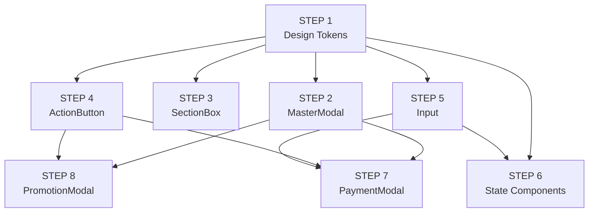

# 🎯 UI Implementation Sequence — VietSale Pro v7

## ⛔ DEPRECATION NOTICE — This Document Is No Longer Active

| | |
|---|---|
| **Status** | ⛔ **DEPRECATED** |
| **Effective Date** | 2026-06-24 |
| **Replaced By** | `UI_MIGRATION_MASTER_ROADMAP.md` — **Single Source of Truth** |
| **Reason** | Scope-limited (8 steps = ~23% of migration). Full migration requires 35 sprints across 6 phases. Maintaining two sequence documents causes AI agent confusion, duplicate maintenance burden, and contradictory ordering. |
| **Migration Governance Rule** | All AI agents **MUST NOT** use this file as a reference for implementation ordering. Read `UI_MIGRATION_MASTER_ROADMAP.md` Section 4 (Sprint Breakdown) for the complete, authoritative implementation sequence. See `CURRENT_SPRINT.md` for the active sprint. |

## 📋 Original Content (Preserved for Reference Only)

**DO NOT USE** the steps below. They are preserved solely for historical reference and cover only ~23% of the migration scope. The original 8-step sequence has been superseded by the 35-sprint roadmap.

> **Mục đích (lịch sử):** Chia nhỏ thứ tự code thành 8 STEP, mỗi STEP chỉ tập trung vào một nhóm component duy nhất.  
> **Nguyên tắc (lịch sử):** Không code lung tung — hoàn thành STEP trước mới chuyển sang STEP sau.  
> **Phạm vi (lịch sử):** Từ Design Tokens → Component cơ bản → Modal → Section → Form → Button → State → Modal nghiệp vụ.
REPLACE

---

## � Tổng quan 8 STEP

| STEP | Nhóm | Component tạo ra | File đích | Phụ thuộc |
|------|------|-----------------|-----------|-----------|
| 1 | **Design Tokens** | CSS custom properties + keyframes | `design-system-tokens.css` | — |
| 2 | **MasterModal** | `MasterModal`, `ModalHeader`, `ModalBody`, `ModalFooter`, `ModalSection`, `ModalInfoGrid`, `ModalTable`, `StatusBadge`, `ModalButton`, `SummaryRow` | `MasterModal.tsx` | STEP 1 |
| 3 | **SectionBox** | `SectionBox`, `SectionHeader`, `SectionContent` | `SectionBox.tsx` | STEP 1 |
| 4 | **ActionButton** | `PrimaryButton`, `SecondaryButton`, `DangerButton`, `GhostButton` | `ActionButton.tsx` | STEP 1 |
| 5 | **Input** | `FormField`, `TextInput`, `SelectInput` | `Input.tsx` | STEP 1 |
| 6 | **State Components** | `LoadingState`, `EmptyState`, `ErrorState` | `StateComponents.tsx` | STEP 1, STEP 5 |
| 7 | **PaymentModal** | `PaymentModal` — thanh toán POS | `PaymentModal.tsx` | STEP 2, STEP 4, STEP 5 |
| 8 | **PromotionModal** | `PromotionModal` — chọn khuyến mãi | `PromotionModal.tsx` | STEP 2, STEP 4 |

---

## �🔗 Dependency Graph



---

## 🗂️ File Structure Mục Tiêu

Sau khi hoàn thành 8 STEP, cấu trúc file component sẽ như sau:

```
components/
├── MasterModal.tsx          # STEP 2 — Modal container + sub-components
├── SectionBox.tsx           # STEP 3 — Section box + header + content
├── ActionButton.tsx         # STEP 4 — PrimaryButton + SecondaryButton + DangerButton + GhostButton
├── Input.tsx                # STEP 5 — FormField + TextInput + SelectInput
├── StateComponents.tsx      # STEP 6 — LoadingState + EmptyState + ErrorState
├── desktop-pos/
│   └── modals/
│       ├── PaymentModal.tsx     # STEP 7 — Payment modal
│       └── PromotionModal.tsx   # STEP 8 — Promotion selection modal
```

> **Lưu ý:** Các component trong `ui.tsx` (Card, Button, Badge, Toast,...) giữ nguyên — không đụng tới.  
> Các file ngoài 8 STEP này (ví dụ: `ProductEditModal.tsx`, `TaxCalculationModal.tsx`, `PayDebtModal.tsx`) sẽ được refactor sau.

---

## ✅ STEP 1 — Design Tokens

### Mục tiêu
Tạo file CSS chứa tất cả design tokens cho modal system: keyframes animation, CSS custom properties cho màu sắc, kích thước, shadow, border radius.

### Component tạo ra
- `@keyframes mmFadeUp` — animation mở modal
- `:root { ... }` — các biến CSS:
  - `--modal-radius` / `--modal-shadow` / `--modal-bg` / `--modal-overlay` / `--modal-border` / `--modal-header-bg` / `--modal-footer-bg`
  - `--modal-title-color` / `--modal-subtitle-color` / `--modal-label-color` / `--modal-value-color`
  - `--status-*` — 6 màu status (success, warning, danger, info, neutral, purple)
  - `--entity-*` — 8 màu entity (category, import, inventory, disposal, order, return, customer, supplier)

### File đích
- `design-system-tokens.css` — **đã có sẵn**, cần kiểm tra và bổ sung nếu thiếu

### Đầu vào
- UI_COMPONENT_ARCHITECTURE.md — bảng Design Token ở mục 2.1

### Đầu ra
```css
@keyframes mmFadeUp {
  from { opacity: 0; transform: translateY(14px) scale(.97); }
  to   { opacity: 1; transform: translateY(0) scale(1); }
}

:root {
  --modal-radius:     1rem;
  --modal-shadow:     0 24px 64px -12px rgba(15, 23, 42, 0.28);
  --modal-bg:         #ffffff;
  --modal-overlay:    rgba(15, 23, 42, 0.52);
  /* ... và các biến khác ... */
}
```

### Checklist kiểm tra
- [ ] Keyframe `mmFadeUp` đã được định nghĩa
- [ ] Tất cả 7 biến `--modal-*` đã có
- [ ] Tất cả 6 biến `--status-*` đã có
- [ ] Tất cả 8 biến `--entity-*` đã có
- [ ] File được import trong `index.css`

---

## ✅ STEP 2 — MasterModal

### Mục tiêu
Tạo Modal container trung tâm + tất cả sub-components dùng trong modal (info grid, table, badge, button, summary).

### Component tạo ra (trong 1 file `MasterModal.tsx`)

| Component | Vai trò | Props chính |
|-----------|---------|-------------|
| `MasterModal` | Container chính | `isOpen`, `onClose`, `title`, `icon`, `badge`, `subtitle`, `children`, `footer`, `size`, `accentColor`, `disableBackdropClose` |
| `ModalSection` | Khối thông tin có viền | `title`, `icon`, `accent`, `children` |
| `ModalInfoGrid` | Grid 2 cột label/value | `items: Array<{label, value, span?, mono?}>` |
| `ModalTable` | Bảng dữ liệu | `headers`, `rows`, `align`, `empty` |
| `StatusBadge` | Badge trạng thái | `label`, `variant` (success/warning/danger/info/neutral/purple), `icon` |
| `ModalButton` | Nút hành động | `onClick`, `variant` (primary/secondary/danger/success/ghost), `children`, `disabled`, `icon` |
| `SummaryRow` | Dòng tổng kết | `label`, `value`, `bold`, `accent` |

### File đích
- `components/MasterModal.tsx` — **đã có sẵn**, cần verify đúng spec

### Design Token sử dụng
- `--modal-overlay`, `--modal-bg`, `--modal-shadow`, `--modal-border`, `--modal-radius`
- `--modal-header-bg`, `--modal-footer-bg`
- `--modal-title-color`, `--modal-subtitle-color`

### Dependencies
- `react`
- `lucide-react` (X icon)
- CSS: `design-system-tokens.css` (STEP 1)

### Hành vi
- Khi `isOpen = false` → return `null` (không render gì)
- Backdrop gọi `onClose` khi click (trừ khi `disableBackdropClose = true`)
- Footer chỉ render khi có `footer` prop
- Animation: `mmFadeUp` 200ms ease-out

### Checklist kiểm tra
- [ ] MasterModal render đúng với mọi size (sm/md/lg/xl/full)
- [ ] Backdrop click đóng modal (trừ khi disableBackdropClose)
- [ ] Icon header hiển thị gradient với accentColor
- [ ] ModalSection render đúng border + title uppercase
- [ ] ModalInfoGrid hiển thị grid 2 cột, item span 2 cột khi cần
- [ ] ModalTable hiển thị bảng, empty state khi không có rows
- [ ] StatusBadge render đúng màu theo variant
- [ ] ModalButton render đúng style theo variant
- [ ] SummaryRow hiển thị đúng label + value, có border-top khi bold

---

## ✅ STEP 3 — SectionBox

### Mục tiêu
Tạo component SectionBox dùng để nhóm nội dung trong ModalBody.

### Component tạo ra (có thể chung 1 file hoặc riêng)

| Component | Vai trò |
|-----------|---------|
| `SectionBox` | Container section có viền + header + content |
| `SectionHeader` | Tiêu đề section (uppercase nhỏ) |
| `SectionContent` | Nội dung section (space-y wrapper) |

### Props

**SectionBox:**
```typescript
export type SectionVariant = 'default' | 'accent' | 'warning' | 'danger';

export interface SectionBoxProps {
  title?:    string;
  icon?:     React.ReactNode;
  accent?:   string;           // Tailwind class override
  variant?:  SectionVariant;
  children:  React.ReactNode;
  className?: string;
}
```

**SectionHeader:**
```typescript
export interface SectionHeaderProps {
  children:  React.ReactNode;
  icon?:     React.ReactNode;
  action?:   React.ReactNode;  // nút "Thêm mới" bên phải
  className?: string;
}
```

**SectionContent:**
```typescript
export interface SectionContentProps {
  children:  React.ReactNode;
  className?: string;
}
```

### File đích
- `components/SectionBox.tsx` — **tạo mới**

### Variant mapping

| Variant | Tailwind classes |
|---------|------------------|
| `default` | `rounded-xl border p-4 bg-slate-50 border-slate-200` |
| `accent` | `rounded-xl border p-4 bg-violet-50 border-violet-200` |
| `warning` | `rounded-xl border p-4 bg-amber-50 border-amber-200` |
| `danger` | `rounded-xl border p-4 bg-red-50 border-red-200` |

### Dependencies
- `react`
- CSS: `design-system-tokens.css` (STEP 1)

### Lưu ý
- `SectionHeader` tự động render bởi `SectionBox` — không cần truyền riêng
- `SectionBox` nhận `children` và đặt vào `SectionContent`

### Checklist kiểm tra
- [ ] SectionBox render đúng 4 variant
- [ ] SectionHeader hiển thị title uppercase + tracking-widest
- [ ] SectionContent wrapper có spacing
- [ ] Action slot bên phải header

---

## ✅ STEP 4 — ActionButton

### Mục tiêu
Tạo 4 loại button chuẩn cho modal footer: Primary, Secondary, Danger, Ghost.

### Component tạo ra

| Component | Vai trò | Style |
|-----------|---------|-------|
| `PrimaryButton` | Hành động chính | `bg-violet-600 text-white hover:bg-violet-700 shadow-sm` |
| `SecondaryButton` | Hành động phụ | `bg-white text-slate-700 border border-slate-200 hover:bg-slate-50` |
| `DangerButton` | Hành động nguy hiểm | `bg-red-50 text-red-600 border border-red-200 hover:bg-red-100` |
| `GhostButton` | Hành động không nổi bật | `text-slate-500 hover:bg-slate-100` |

### Props chung
```typescript
interface ActionButtonProps {
  onClick?:       () => void;
  type?:          'button' | 'submit';
  disabled?:      boolean;
  loading?:       boolean;
  size?:          'sm' | 'md' | 'lg';
  icon?:          React.ReactNode;
  children:       React.ReactNode;
  className?:     string;
}
```

### File đích
- `components/ActionButton.tsx` — **tạo mới**

### Size mapping

| Size | Tailwind (padding + text) |
|------|--------------------------|
| `sm` | `px-3 py-1.5 text-xs rounded-lg` |
| `md` | `px-4 py-2 text-sm rounded-xl` |
| `lg` | `px-6 py-2.5 text-base rounded-xl` |

### Dependencies
- `react`
- `lucide-react` (Loader2 cho loading spinner)

### Hành vi loading
```tsx
{loading ? <Loader2 className="w-4 h-4 animate-spin" /> : children}
```

### Checklist kiểm tra
- [ ] PrimaryButton render đúng gradient/background violet
- [ ] SecondaryButton render đúng border + hover bg-slate-50
- [ ] DangerButton render đúng màu đỏ
- [ ] GhostButton render đúng text xám + hover bg-slate-100
- [ ] Loading state hiển thị spinner
- [ ] Disabled state: opacity-50 + cursor-not-allowed
- [ ] 3 size hoạt động đúng (sm/md/lg)

---

## ✅ STEP 5 — Input

### Mục tiêu
Tạo FormField wrapper + TextInput + SelectInput cho modal form.

### Component tạo ra

| Component | Vai trò |
|-----------|---------|
| `FormField` | Wrapper label + error + hint |
| `TextInput` | Input text với icon trái/phải |
| `SelectInput` | Select dropdown với options |

### File đích
- `components/Input.tsx` — **tạo mới**

### FormField Props
```typescript
interface FormFieldProps {
  label:          string;
  required?:      boolean;
  error?:         string;
  hint?:          string;
  children:       React.ReactNode;
  className?:     string;
}
```

### TextInput Props
```typescript
type InputVariant = 'default' | 'success' | 'error';

interface TextInputProps extends Omit<React.InputHTMLAttributes<HTMLInputElement>, 'size'> {
  variant?:     InputVariant;
  leftIcon?:    React.ReactNode;
  rightIcon?:   React.ReactNode;
  className?:   string;
}
```

### SelectInput Props
```typescript
interface SelectInputProps extends Omit<React.SelectHTMLAttributes<HTMLSelectElement>, 'size'> {
  options:      Array<{ value: string; label: string }>;
  variant?:     InputVariant;
  leftIcon?:    React.ReactNode;
  placeholder?: string;
  className?:   string;
}
```

### Variant mapping (cho cả TextInput và SelectInput)

| Variant | Border | Focus |
|---------|--------|-------|
| `default` | `border-slate-200` | `focus:border-violet-500 focus:ring-2 focus:ring-violet-500/10` |
| `success` | `border-emerald-300` | `focus:border-emerald-500 focus:ring-2 focus:ring-emerald-500/10` |
| `error` | `border-red-300` | `focus:border-red-500 focus:ring-2 focus:ring-red-500/10` |

### Dependencies
- `react`
- CSS: `design-system-tokens.css` (STEP 1)

### Checklist kiểm tra
- [ ] FormField hiển thị label + required asterisk (*)
- [ ] FormField hiển thị error message màu đỏ khi có error
- [ ] FormField hiển thị hint text màu xám khi có hint
- [ ] TextInput render đúng 3 variant (default/success/error)
- [ ] TextInput hiển thị leftIcon và rightIcon
- [ ] SelectInput render đúng options từ prop
- [ ] SelectInput có placeholder "-- Chọn --"

---

## ✅ STEP 6 — State Components

### Mục tiêu
Tạo 3 component trạng thái dùng trong ModalBody: Loading, Empty, Error.

### Component tạo ra

| Component | Vai trò |
|-----------|---------|
| `LoadingState` | Spinner trung tâm + text tuỳ chọn |
| `EmptyState` | Icon + title + description + action |
| `ErrorState` | Icon lỗi + message + retry button |

### File đích
- `components/StateComponents.tsx` — **tạo mới**

### Props

**LoadingState:**
```typescript
interface LoadingStateProps {
  text?: string;        // "Đang tải dữ liệu..."
  size?: 'sm' | 'md' | 'lg';
}
```

**EmptyState:**
```typescript
interface EmptyStateProps {
  icon?:        React.ReactNode;
  title:        string;
  description?: string;
  action?:      React.ReactNode;   // Ví dụ: <PrimaryButton>Thêm mới</PrimaryButton>
}
```

**ErrorState:**
```typescript
interface ErrorStateProps {
  message:    string;
  onRetry?:   () => void;
  retryText?: string;               // "Thử lại"
}
```

### Dependencies
- `react`
- `lucide-react` (Loader2, AlertCircle, Inbox)
- `ActionButton.tsx` (STEP 4) — ErrorState dùng PrimaryButton cho retry

### Hành vi

**LoadingState:**
```tsx
<div className="flex flex-col items-center justify-center py-16">
  <Loader2 className="w-10 h-10 animate-spin text-violet-600" />
  {text && <p className="mt-4 text-sm text-slate-500">{text}</p>}
</div>
```

**EmptyState:**
```tsx
<div className="flex flex-col items-center justify-center py-16 px-4 text-center">
  <div className="w-20 h-20 rounded-3xl bg-slate-100 flex items-center justify-center mb-5 text-slate-400">
    {icon || <Inbox className="w-8 h-8" />}
  </div>
  <h3 className="text-lg font-bold text-slate-900 mb-1">{title}</h3>
  {description && <p className="text-sm text-slate-500 max-w-xs">{description}</p>}
  {action && <div className="mt-4">{action}</div>}
</div>
```

**ErrorState:**
```tsx
<div className="flex flex-col items-center justify-center py-16 px-4 text-center">
  <div className="w-20 h-20 rounded-3xl bg-red-50 flex items-center justify-center mb-5">
    <AlertCircle className="w-8 h-8 text-red-500" />
  </div>
  <h3 className="text-lg font-bold text-slate-900 mb-1">Có lỗi xảy ra</h3>
  <p className="text-sm text-red-500 mb-4">{message}</p>
  {onRetry && (
    <PrimaryButton onClick={onRetry} size="sm">
      {retryText || 'Thử lại'}
    </PrimaryButton>
  )}
</div>
```

### Checklist kiểm tra
- [ ] LoadingState hiển thị spinner + text tuỳ chọn
- [ ] EmptyState hiển thị icon + title + description + action
- [ ] ErrorState hiển thị icon lỗi + message + retry button
- [ ] Cả 3 component đều căn giữa, padding phù hợp
- [ ] ErrorState dùng PrimaryButton từ STEP 4

---

## ✅ STEP 7 — PaymentModal

### Mục tiêu
Tạo modal thanh toán cho POS Desktop.

### Component tạo ra
- `PaymentModal` — modal thanh toán với:
  - Header gradient tím + tổng tiền
  - 3 phương thức thanh toán: Tiền mặt / Chuyển khoản / Thẻ
  - Input số tiền + các nút gợi ý số tiền
  - Hiển thị tiền thừa
  - Nút xác nhận thanh toán

### File đích
- `components/desktop-pos/modals/PaymentModal.tsx` — **đã có sẵn, cần refactor theo chuẩn STEP 2 + 4 + 5**

### Props
```typescript
interface PaymentModalProps {
  isOpen: boolean;
  onClose: () => void;
  finalTotal: number;
  paymentMethod: string;
  onPaymentMethodChange: (method: string) => void;
  amountPaid: string;
  onAmountPaidChange: (value: string) => void;
  onConfirm: () => void;
  isProcessing: boolean;
}
```

### Refactor checklist
- [ ] Dùng `MasterModal` (STEP 2) thay vì tự render backdrop + motion.div
- [ ] Dùng `PrimaryButton` (STEP 4) cho nút xác nhận
- [ ] Dùng `SecondaryButton` (STEP 4) cho nút đóng
- [ ] Dùng `TextInput` (STEP 5) cho input số tiền
- [ ] Header gradient tím giữ nguyên (custom qua `accentColor`)
- [ ] Grid 3 phương thức thanh toán giữ nguyên
- [ ] Quick amount buttons giữ nguyên
- [ ] Tiền thừa hiển thị giữ nguyên
- [ ] Loading state khi đang xử lý (dùng icon spinner)

---

## ✅ STEP 8 — PromotionModal

### Mục tiêu
Tạo modal chọn khuyến mãi cho POS Desktop.

### Component tạo ra
- `PromotionModal` — modal chọn khuyến mãi với:
  - Header gradient tím
  - Danh sách khuyến mãi kèm discount preview
  - Checkbox selection (radio-style)
  - Footer: tổng số đã chọn + tổng giảm + nút xác nhận

### File đích
- `components/desktop-pos/modals/PromotionModal.tsx` — **đã có sẵn, cần refactor theo chuẩn STEP 2 + 4**

### Props
```typescript
interface PromotionModalProps {
  isOpen: boolean;
  onClose: () => void;
  suggestions: { promotion: Promotion; result: { appliedPromotions: AppliedPromotion[]; totalDiscount: number } }[];
  selectedPromotions: Promotion[];
  onTogglePromotion: (promo: Promotion) => void;
}
```

### Refactor checklist
- [ ] Dùng `MasterModal` (STEP 2) thay vì tự render backdrop + motion.div
- [ ] Dùng `PrimaryButton` (STEP 4) cho nút "Xác nhận"
- [ ] Dùng `EmptyState` (STEP 6) cho trường hợp không có khuyến mãi
- [ ] Header gradient tím giữ nguyên (custom qua `accentColor`)
- [ ] Danh sách KM với border highlight giữ nguyên
- [ ] Checkbox radio-style giữ nguyên
- [ ] Footer tổng kết giữ nguyên

---

## 📊 So sánh Trước/Sau

### Trước khi có UI_IMPLEMENTATION_SEQUENCE
```
components/
├── MasterModal.tsx          # ✅ đã có (cần verify)
├── ui.tsx                   # ✅ đã có (giữ nguyên)
├── desktop-pos/
│   ├── PaymentModal.tsx     # ❌ code thủ công, chưa dùng MasterModal
│   └── PromotionModal.tsx   # ❌ code thủ công, chưa dùng MasterModal
├── ... (nhiều modal khác chưa refactor)
```

### Sau khi hoàn thành 8 STEP
```
components/
├── MasterModal.tsx          # ✅ STEP 2 — verify hoàn chỉnh
├── SectionBox.tsx           # ✅ STEP 3 — tạo mới
├── ActionButton.tsx         # ✅ STEP 4 — tạo mới
├── Input.tsx                # ✅ STEP 5 — tạo mới
├── StateComponents.tsx      # ✅ STEP 6 — tạo mới
├── ui.tsx                   # ✅ giữ nguyên
├── desktop-pos/
│   ├── PaymentModal.tsx     # ✅ STEP 7 — refactor xong
│   └── PromotionModal.tsx   # ✅ STEP 8 — refactor xong
```

---

## 🚫 Quy tắc khi code

1. **KHÔNG code nhiều STEP cùng lúc** — hoàn thành STEP trước mới qua STEP sau
2. **KHÔNG sửa file ngoài STEP hiện tại** — nếu thấy lỗi ở file khác, ghi chú lại
3. **KHÔNG dùng component từ STEP chưa hoàn thành** — nếu STEP 4 chưa xong, không dùng PrimaryButton ở STEP 7
4. **Mỗi STEP phải pass checklist** trước khi move on
5. **Nếu cần sửa design-system-tokens.css** (STEP 1), quay lại STEP 1 trước

---

## 🚦 Trạng thái

| STEP | Component | Trạng thái | Ghi chú |
|------|-----------|-----------|---------|
| 1 | `design-system-tokens.css` | ❌ Chưa verify | Cần kiểm tra đủ tokens chưa |
| 2 | `MasterModal.tsx` | ❌ Chưa verify | Cần kiểm tra đúng spec chưa |
| 3 | `SectionBox.tsx` | ❌ Chưa tạo | File chưa tồn tại |
| 4 | `ActionButton.tsx` | ❌ Chưa tạo | File chưa tồn tại |
| 5 | `Input.tsx` | ❌ Chưa tạo | File chưa tồn tại |
| 6 | `StateComponents.tsx` | ❌ Chưa tạo | File chưa tồn tại |
| 7 | `PaymentModal.tsx` | ❌ Chưa refactor | Đã có nhưng chưa dùng MasterModal |
| 8 | `PromotionModal.tsx` | ❌ Chưa refactor | Đã có nhưng chưa dùng MasterModal |